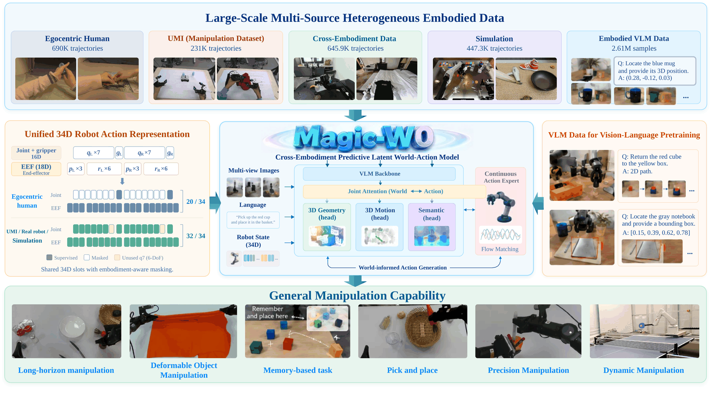

# Magic-W0: A Structured World–Action Foundation Model for Physical Intelligence

*Magic-Lab Team · Magiclab Robotics Inc.*

 

[Update News](#update-news) · [Abstract](#abstract) · [Key Features](#key-features) · [Getting Started](#getting-started)

## Update News

- **[2026-09-30]** Added the project overview. Code and pretrained checkpoints are coming soon.

## Abstract

Magic-W0 learns structured world transitions and continuous robot actions from diverse embodied experience. It represents the current scene, action-induced 3D motion, and task-relevant future semantics, and couples world prediction with action generation through layer-aligned interaction. Pretrained on approximately 2.014M effective action episodes and 2.61M visual-language samples, it achieves 99.05% average success on LIBERO and 94.6% across five real-robot tasks after downstream fine-tuning.

  

## Key Features

- **World–action modeling:** learn geometry, motion, future semantics, and continuous control together.
- **Cross-embodiment data:** use a shared 34D state–action interface with masks for missing dimensions.
- **Teacher-free policy execution:** use Track4World and DINOv3 supervision during training without running these teachers at inference.
- **Configurable training workflows:** adapt YAML recipes for pretraining, fine-tuning, and distributed execution.
- **Checkpoint diagnostics:** check inference contracts and evaluate generated actions and world representations.

## Getting Started

### Installation

Coming soon: environment requirements, dependency installation, and a setup check.

### Model Checkpoints

Coming soon: checkpoint downloads, required assets, and model loading examples.

### Data Preparation

Coming soon: supported data formats, custom dataset configuration, and normalization instructions.

### Training and Fine-tuning

Coming soon: training configurations, single-node and multi-node launch commands, fine-tuning, and checkpoint resumption.

### Inference and Deployment

Coming soon: a minimal inference example, observation preparation, action decoding, and robot integration instructions.

### Evaluation

Coming soon: checkpoint diagnostics, benchmark setup, and evaluation commands.
